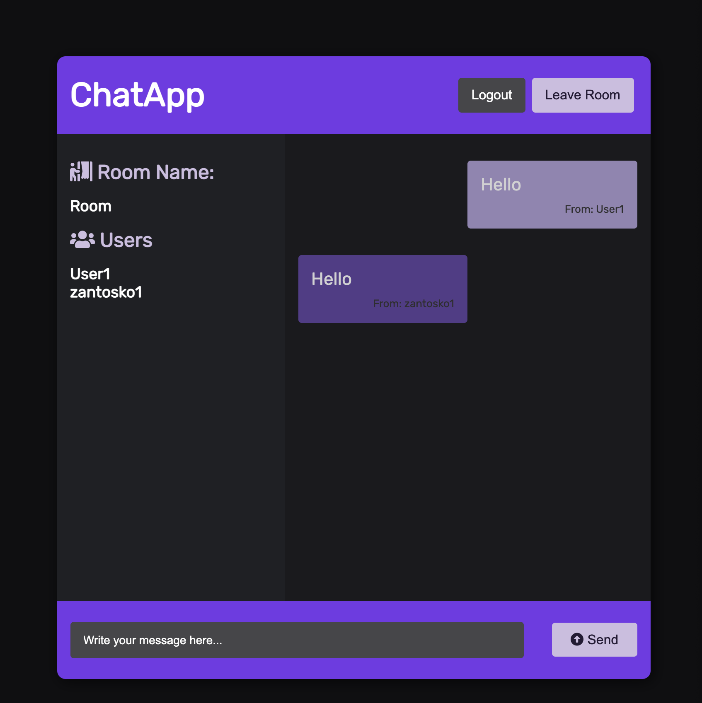
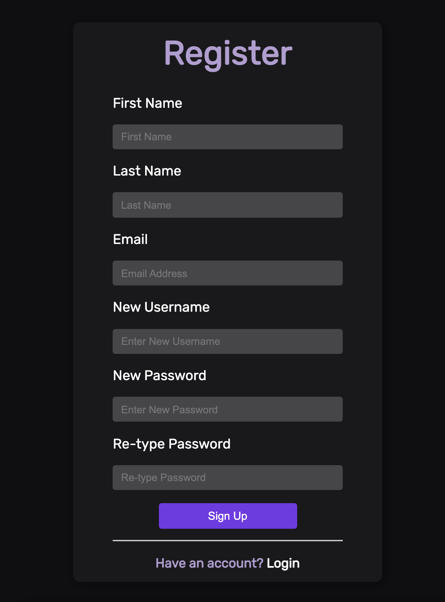
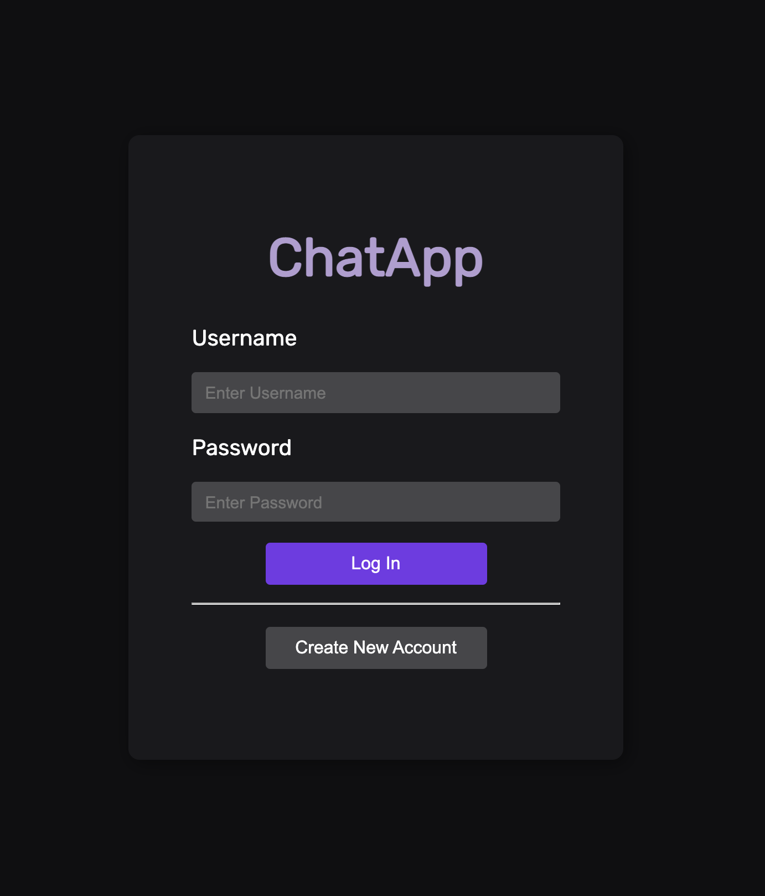
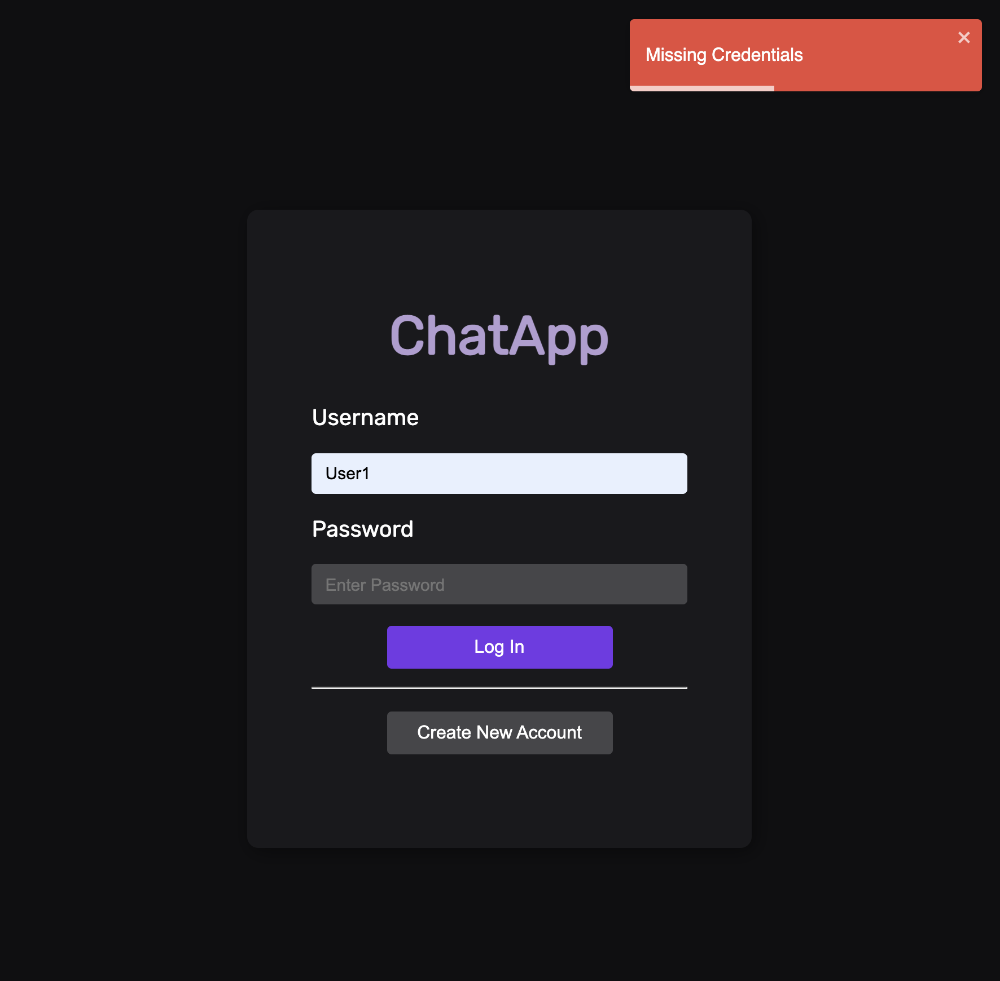
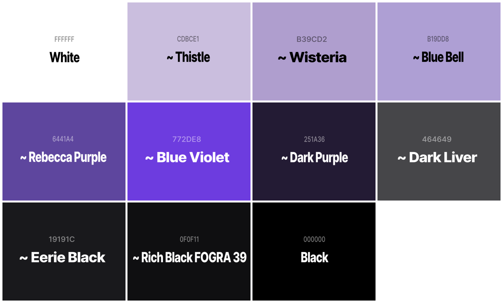

# React ChatApp

## Description

This a real-time chat application that requires users create account and login. Key features include the use Socket.io for real-time connection and JWT (JSON Web Token) for user authentication. Even though this project had a heavy focus on the backend, another goal in mind was to learn how to make a complete full stack application with React, Node.js, PostgreSQL.

## Screenshots

  

  

  

  

  

## Website Color Palette

  

## Key Features

- **JWT Authentication** -

- **Real Time Communication with Socket.io** -

## Technologies Used

**Client-Side**:
- React/Redux
- React Router
- Styled Components
- React Toastify
- Socket.io-client

**Server-Side**:
- Node.js
- Express.js
- Socket.io
- JSON Web Token (JWT)
- PostgreSQL
- Sequelize
- Bcrypt

**NPM Packages**:
`Client`:
- “react-redux”: “^7.2.4”,
- “react-router-dom”: “^5.2.0”,
- “react-scripts”: “4.0.3”,
- “react-toastify”: “^7.0.4”,
- “redux”: “^4.1.0”,
- “redux-logger”: “^3.0.6”,
- “socket.io-client”: “^4.1.2”,
- “styled-components”: “^5.3.0”,

`Server`:
- “bcrypt”: “^5.0.1”,
- “cors”: “^2.8.5”,
- “dotenv”: “^10.0.0”,
- “express”: “^4.17.1”,
- “jsonwebtoken”: “^8.5.1”,
- “sequelize”: “^6.6.2”,
- “socket.io”: “^4.1.2”
- “sequelize-cli”: “^6.2.0”